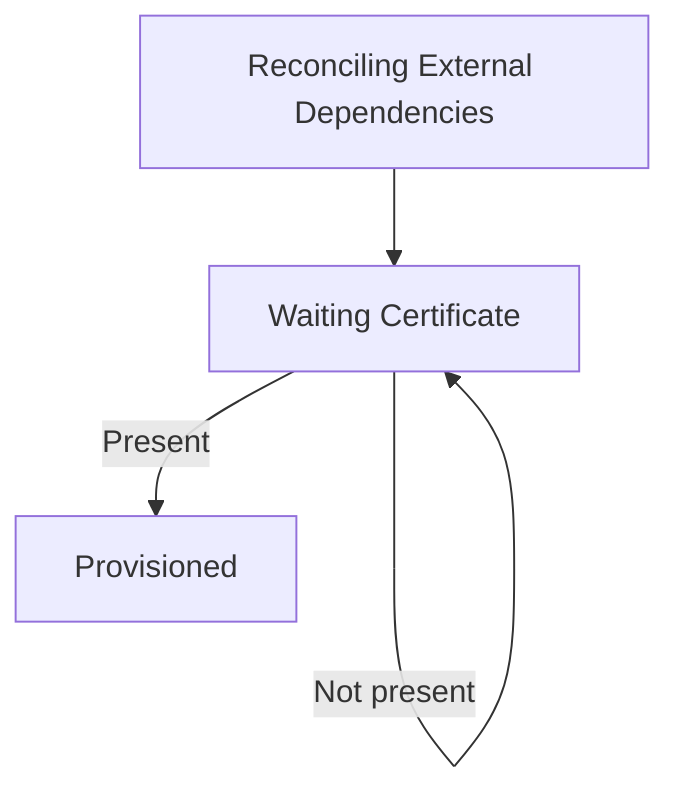
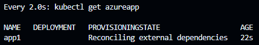
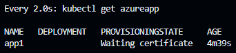
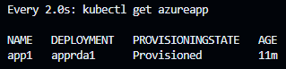
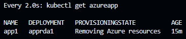

# Azure app Operator
- [Azure app Operator](#azure-app-operator)
  - [Description](#description)
  - [How it works](#how-it-works)
    - [Provisioning states and example usage](#provisioning-states-and-example-usage)
      - [Usage breakdown](#usage-breakdown)
  - [Test It Out](#test-it-out)
  - [Conclusion](#conclusion)


## Description
This project explore Kubernetes operators to manage Azure applications leveraging the idempotent nature of Terraform through [`tfexec`](https://github.com/hashicorp/terraform-exec). The idea is to delegate resource management to Terraform whenever possible and to complement it when it's not. In this project we manage the Azure app registration, service principal, key vault, SQL database and all access policies and IAM roles necessarry with Terraform and use a SQL server driver to manage the app's access and permission on the database.

The idea is also to allow contributors that doesn't necessarily knows Go or Kubernetes to contribute and make sense of the infrastructure being provisioned through the usage of Terraform and it's modules.

## How it works
This project aims to follow the Kubernetes [Operator pattern](https://kubernetes.io/docs/concepts/extend-kubernetes/operator/)

It uses [Controllers](https://kubernetes.io/docs/concepts/architecture/controller/) 
which provides a reconcile function responsible for synchronizing resources until the desired state is reached on the cluster 

For terraform magement, it uses an Azure storage account backend. The idea is that the operator will have credentials to manage a resource group with all app's resources from a given namespace. To keep the state files to a minimum size and avoid interference across apps, it generates a state for each app. So, for each AzureApp provisioned the reconcile function will:\
1 - create a directory (Terraform workdir for the app)\
2 - render Terraform `main.tf` with proper state reference for the app\
3 - run terraform init and plan\
4 - if plan accuses any changes, apply them, otherwise, move on\
5 - manage database access\
6 - manage kubernetes objects\
7 - wait for tls certificate to be present in keyvault's app

Since it's just an experimental project and I want to keep my Azure bill to a minimum, the operator implements an aggressive finalizer. It runs a Terraform destroy and also deletes the state file for the given app.

### Provisioning states and example usage

#### Usage breakdown
- apply phase:
> `kubectl apply -f .\config\samples\k8sapp1.yaml`\
> First phase is provisioning/reconciling external dependencies\
> \
> once dependencies are ready, the controller checks if there is a tls certificate present in the app's key vault, if there isn't, the reconcile loop gets requeued after 30 seconds\
> \
> if there is a certificate present, kubernetes objects are deployed\
> \
> 

- delete phase:
> `kubectl delete azureapp app1`\
> \
> After terraform destroy runs successfully, the state also gets deleted from the storage account and the finalizer is removed so the k8s objects can get deleted.

## Test It Out
1. Install the CRDs into the cluster:

```sh
make install
```

2. Run your controller (this will run in the foreground, so switch to a new terminal if you want to leave it running):

```sh
make run
```

**NOTE:** You can also run this in one step by running: `make install run`

## Conclusion
Terraform does a great job on reconciling external resources state in a simple manner. It also allows for external modules usage, facilitating contributions comprehension from people that doesn't know Go or Kubernetes. The downsides from my perpective are 1. the process of initing, planning and eventually applying are not that fast, so if you need super fast provisioning and reconciliation maybe it's not the right fit and 2. The maintence and resource overhead of storing app's state on a remote location.
